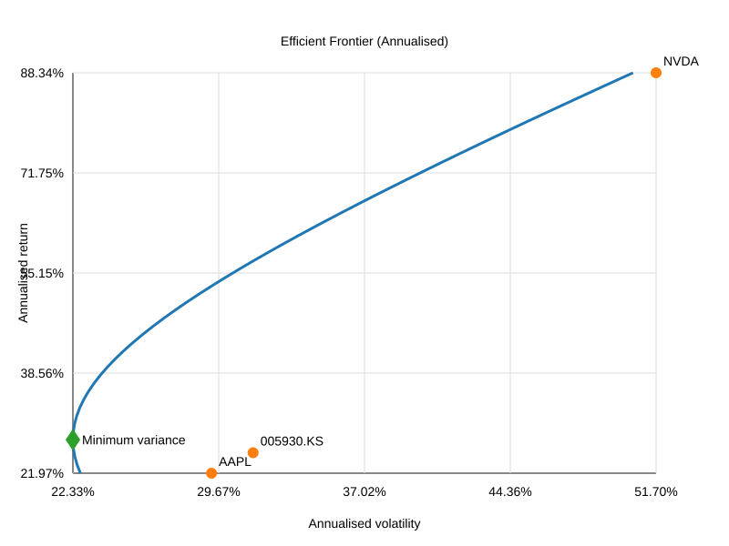

# Stock Price Summary

This repository contains a single dataset, `temp.csv`, with end-of-day pricing data for three equities:

- Samsung Electronics (005930.KS)
- Apple Inc. (AAPL)
- NVIDIA Corp. (NVDA)

Each trading day records the open, high, low, close, and volume metrics for every ticker. The file is organised with a two-row header, where the first row lists the metric and the second row lists the ticker symbol. The first column holds the trading date.

## 작업 내용

- `temp.csv` 데이터를 요약하고 결측치를 집계하는 기술 통계 스크립트를 작성했습니다.
- 일별 수익률을 기반으로 한 연간화 평균-분산 효율적 프런티어를 계산하고 시각화했습니다.
- 효율적 프런티어 SVG와 주요 통계 지표를 하나의 대시보드로 보여 주는 정적 웹사이트를 구성했습니다.
- 대시보드를 로컬에서 바로 확인할 수 있도록 표준 라이브러리 기반 HTTP 서버를 추가했습니다.

## Coverage

- **Date range:** 2023-10-16 to 2025-10-10
- **Trading days captured:** 516 rows in the file
- **Missing closes:** 34 days for 005930.KS, 17 days for AAPL, and 17 days for NVDA (those dates contain data for the other tickers but omit the listed instrument).

## Descriptive statistics

| Ticker | Avg Close | Min Close | Max Close | Avg Daily Range | Avg Volume | Best Daily Return | Worst Daily Return | Observations |
| --- | ---: | ---: | ---: | ---: | ---: | ---: | ---: | ---: |
| 005930.KS | 66471.53 | 48968.97 | 94400.00 | 1379.43 | 19481205 | 7.21% | -10.30% | 482 |
| AAPL | 209.52 | 163.82 | 258.10 | 4.14 | 56558297 | 15.33% | -9.25% | 499 |
| NVDA | 115.60 | 40.30 | 192.57 | 4.14 | 325122505 | 18.72% | -16.97% | 499 |

**Column descriptions**

- *Avg Close / Min Close / Max Close*: Arithmetic mean, minimum, and maximum of the recorded daily closing prices.
- *Avg Daily Range*: Average of the difference between the daily high and low, a proxy for intraday volatility.
- *Avg Volume*: Mean traded shares for each symbol.
- *Best/Worst Daily Return*: Maximum and minimum one-day percentage change in the closing price within the observed period.
- *Observations*: Number of trading days with available close data for the ticker.

## Relationships and notable patterns

- Daily return correlations indicate weak co-movement between Samsung Electronics and the U.S. equities (ρ≈0.02 with AAPL and ρ≈-0.03 with NVDA), while Apple and NVIDIA show a moderate positive relationship (ρ≈0.37).
- NVIDIA exhibits the widest swing in daily closes (−16.97% to +18.72%), underscoring higher volatility relative to Apple and Samsung.
- Samsung trades with the narrowest average daily range in relative terms, but its absolute price level keeps the range over ₩1,300 per day. Apple and NVIDIA show similar average ranges in USD terms, yet NVIDIA's volume is roughly six times Apple's, reflecting heavier trading activity during the sample.

## 실행 방법

분석과 시각화, 웹 대시보드를 재현하려면 아래 스크립트를 실행하세요. 모든 스크립트는 표준 라이브러리만 사용하므로 추가 의존성 설치가 필요 없습니다.

1. **기술 통계 및 결측치 요약**

   ```bash
   python scripts/describe.py
   ```

   `temp.csv`의 기본 통계, 결측치, 수익률 상관관계를 계산하여 표 형태로 출력합니다.

2. **효율적 프런티어 분석**

   ```bash
   python scripts/efficient_frontier.py
   ```

   세 종목의 일별 수익률을 정렬한 뒤 연간화된 평균 수익률과 공분산을 구해 효율적 프런티어 곡선을 생성하고 `figures/efficient_frontier.svg`에 저장합니다.

3. **웹 대시보드 실행**

   ```bash
   python scripts/serve_dashboard.py
   ```

   기본적으로 `http://127.0.0.1:8000/`에서 `web/index.html`을 제공하며, 포트가 사용 중인 경우 자동으로 가용 포트를 선택합니다. 브라우저에서 접속하면 앞선 분석 결과를 확인할 수 있습니다.

## Efficient frontier analysis

To understand the diversification benefits between Samsung Electronics, Apple, and NVIDIA, we compute the annualised mean-variance efficient frontier using daily close-to-close returns. The resulting curve shows the minimum achievable volatility for any target return that blends the three equities, while the individual points display each asset's standalone risk/return trade-off. The star marks the global minimum variance portfolio.



Reproduce the figure with:

```bash
python scripts/efficient_frontier.py
```

The script aligns trading days with complete data across all tickers, annualises their average returns and covariance, and saves the plot to `figures/efficient_frontier.svg`.

## Web dashboard

An interactive-ready static site packages the descriptive statistics and efficient frontier visual in a single view. Open `web/index.html` directly in your browser or start the bundled development server:

```bash
python scripts/serve_dashboard.py
```

The server binds to `http://127.0.0.1:8000/` by default (falling back to a free port if needed) and rewrites the root path to the dashboard entry point so you can immediately explore the analysis and the efficient frontier figure.
